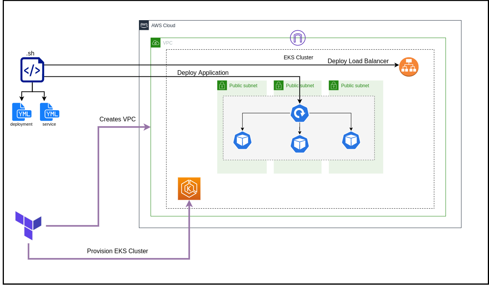

# AWS EKS DEPLOYMENT

<p align="center">
  
</p>


## CREATE EKS

### Pre-requisites:

 - ~/.aws/credentials
 - awscli configs done
 - terraform

### Steps:

 - go to /eks-provisioner
 - terraform init
 - terraform plan
 - terraform apply

## DEPLOY APP TO EKS

### Pre-requisites:
 - a kubectl setup for the AWS EKS cluster made

 for e.g 

 ```
 aws configure
 
 ...

 aws eks --region us-east-1 describe-cluster --name eks-cluster --query cluster.status
 aws eks --region us-east-1 update-kubeconfig --name eks-cluster
 ```

### Steps:

 - run deploy-to-k8s.sh


## Done!

### Sugestion: 

 - try scale the application

  ```
  kubectl scale deployment simple-nodejs-app --replicas 2
  ```

 